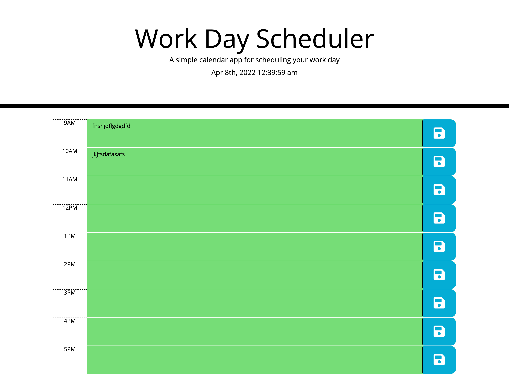

# day_Planner_JD

Day Planner homework for UCF bootcamp

Completed by Joshua Diaz

# Project Description:

Created an interactive webpage that acts as a workday planner. In this webpage it allows the user to enter data on any given time block. The time blocks will change color according to current time of the day. All saved data gets saved to the local storage.

# Project Location:
[Github Live Link](https://jdiaz240.github.io/day_Planner_JD/)

[Github repository](https://github.com/Jdiaz240/day_Planner_JD)

# Project Screenshot:

